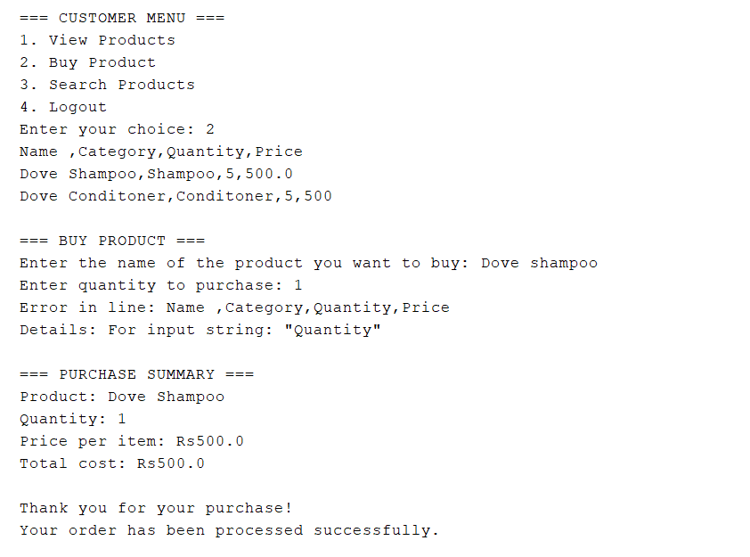

<h1 align="center">Tharu Cosmetic Shop - Java OOP Project</h1>

<h2>📝 Project Description</h2>

Tharu Cosmetic Shop is a Java-based console application designed to manage a cosmetic store's inventory and user system. It follows Object-Oriented Programming (OOP) principles and implements full CRUD operations to provide functionalities for both admin and customer roles.

<h2>🔹 Key Features</h2>

<h3>👨‍💼 Admin Features</h3>
<ul>
  <li><strong>User Management</strong>: View all users (admins & customers).</li>
  <li><strong>Product Management (CRUD Operations)</strong>:
    <ul>
      <li><strong>Create</strong>: Add new cosmetic products</li>
      <li><strong>Read</strong>: View/search all products</li>
      <li><strong>Update</strong>: Modify stock quantities</li>
      <li><strong>Delete</strong>: Remove products from inventory</li>
    </ul>
  </li>
  <li><strong>Inventory Control</strong>: View all available products.</li>
</ul>

<h3>👩‍💼 Customer Features</h3>
<ul>
  <li><strong>Browse Products (Read)</strong>: View available cosmetic items</li>
  <li><strong>Search Functionality</strong>: Find products by name or category</li>
  <li><strong>Order Products (Update)</strong>: Purchase items, with automatic stock updates</li>
</ul>

<h3>🔐 Authentication System</h3>
<ul>
  <li><strong>Create</strong>: New customer registration</li>
  <li><strong>Read</strong>: User login and authentication</li>
</ul>

<h2>🛠️ Technologies & Concepts Used</h2>
<ul>
  <li><strong>Java Core</strong> with File I/O operations</li>
  <li><strong>Complete CRUD Implementation</strong> for product management</li>
  <li><strong>OOP Principles</strong>:
    <ul>
      <li>Encapsulation (Private fields with getters)</li>
      <li>Inheritance (Admin & Customer extend User)</li>
      <li>Polymorphism (Runtime type checking)</li>
      <li>Abstraction (File operations handling)</li>
    </ul>
  </li>
  <li><strong>CSV File Storage</strong> for persistent data</li>
  <li><strong>ArrayList</strong> for dynamic data storage</li>
</ul>

## 📸 Application Screenshots
### 🔐 Home Screen
| Home Screen | 
|--------------|
|  | 

### 🔐 Authentication
| Login Screen | Registration Screen |
|--------------|---------------------|
|  |  |

### 🛍️ Admin Dashboard
| View User | 
|-------------|
|  |

### 🛍️ Customer Dashboard
| View User | 
|-------------|
|  |

### 🛍️ Product Management (Admin)
| Add Product | View Products | Update Stock |
|-------------|---------------|--------------|
|  |  |  |

### 🛍️ User Management (Admin)
| View User | 
|-------------|
|  |

### 🛒 Shopping Experience (Customer)
| Browse Products | Search Products | Place Order |
|-----------------|-----------------|-------------|
|  |  |  |

<h2>🚀 How to Run</h2>
<ol>
  <li>Clone the repository</li>
  <li>Open in Java IDE (NetBeans/Eclipse/IntelliJ)</li>
  <li>Run TharuCosmeticShop.java</li>
</ol>

<strong>🌟 Star the repo if you like it! Contributions are welcome.</strong> 🚀

